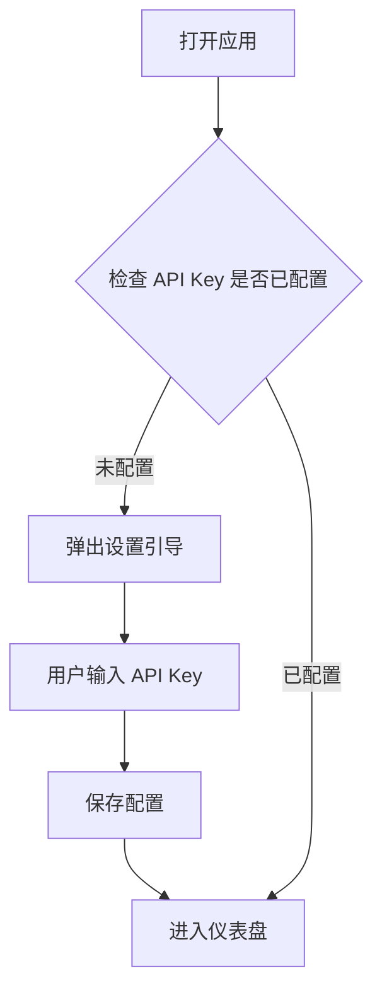
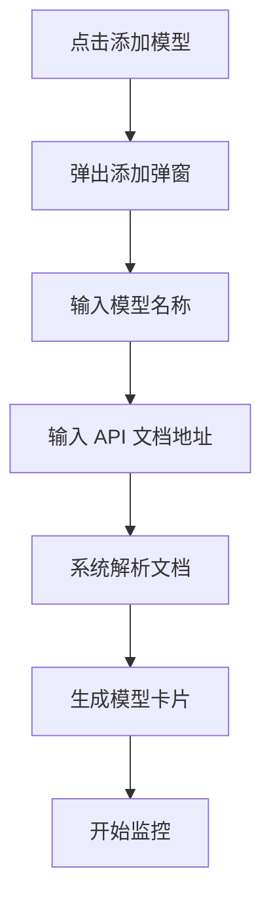
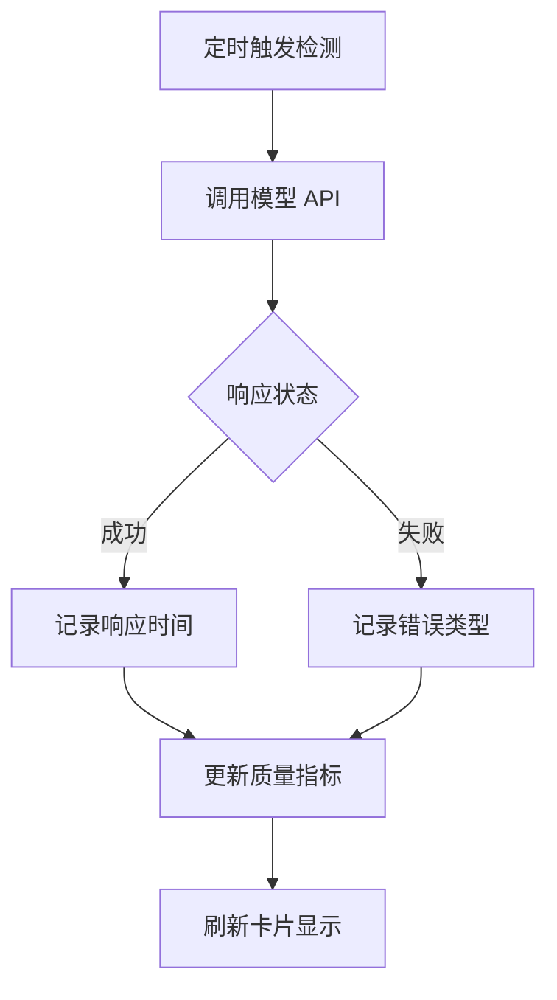

# LLM 服务质量实时监控平台 - 产品需求文档

## 1. 产品概述

一个通过 AI 实时监测大模型服务质量的网页监控平台，通过固定周期收集影响质量的指标数据来实现感知服务质量。

- **核心目的**：帮助用户实时了解所接入的 LLM API 服务质量状态
- **目标用户**：开发者、DevOps 工程师、AI 应用运维人员
- **市场价值**：提供直观、高效的服务质量可视化，降低 LLM 服务监控门槛

## 2. 核心功能

### 2.1 用户角色

| 角色 | 注册方式 | 核心权限 |
|------|----------|----------|
| 普通用户 | 无需注册 | 配置 API Key、添加模型卡片、查看监控数据 |

### 2.2 功能模块

1. **设置页面** - 配置 AI API Key
2. **模型卡片管理** - 添加/删除模型卡片
3. **监控仪表盘** - 展示所有模型实时质量状态
4. **模型详情卡片** - 单个模型的详细质量指标

### 2.3 页面详情

| 页面名称 | 模块名称 | 功能描述 |
|----------|----------|----------|
| 设置面板 | API Key 配置 | 输入并保存 AI 服务商 API Key，支持多个服务商 |
| 仪表盘首页 | 模型卡片网格 | 展示所有已添加模型的质量状态卡片 |
| 添加模型弹窗 | 模型添加表单 | 输入模型名称和 API 文档地址快速生成模型卡片 |
| 模型卡片 | 质量指标展示区 | 显示响应时间、错误率、繁忙度等实时指标 |
| 模型卡片 | 繁忙度指示器 | 彩色圆角矩形展示当前服务繁忙程度 |

## 3. 核心流程

### 3.1 首次使用流程

### 3.2 添加模型流程

### 3.3 质量监测流程

## 4. 用户界面设计

### 4.1 设计风格

- **整体风格**：极简主义、工业感、数据可视化导向
- **配色方案**：
  - 主色：深空灰 `#1a1a2e`
  - 背景：暗夜蓝 `#16213e`
  - 强调色：科技青 `#0f3460`
  - 状态色：
    - 空闲：薄荷绿 `#00d9a5`
    - 正常：天际蓝 `#4facfe`
    - 繁忙：琥珀橙 `#ffa500`
    - 危险：错误红 `#ff6b6b`
- **字体**：JetBrains Mono (数据) + Noto Sans SC (界面)
- **布局**：卡片网格布局，响应式设计
- **图标风格**：Lucide 线性图标

### 4.2 页面设计概览

| 页面名称 | 模块名称 | UI 元素 |
|----------|----------|---------|
| 仪表盘 | 顶部导航栏 | Logo、设置按钮、添加模型按钮 |
| 仪表盘 | 模型卡片网格 | 圆角矩形卡片，等宽分布 |
| 模型卡片 | 状态头部 | 模型名称 + 繁忙度圆角矩形指示器 |
| 模型卡片 | 质量指标区 | 响应时间、错误率、成功率数据 |
| 模型卡片 | 趋势图表 | 简单迷你折线图展示历史趋势 |
| 添加弹窗 | 表单区域 | 输入框、确认/取消按钮 |
| 设置面板 | 配置表单 | API Key 输入框、服务商选择 |

### 4.3 响应式设计

- **桌面优先**：1200px+ 优化
- **平板适配**：768px-1199px 双列布局
- **移动端**：< 768px 单列堆叠

### 4.4 动效设计

- 卡片悬停：轻微上浮 + 阴影加深
- 数据更新：数字滚动动画
- 状态变化：颜色渐变过渡 300ms
- 页面加载：卡片依次淡入 stagger 效果

## 5. 数据指标定义

### 5.1 繁忙度等级

| 等级 | 响应时间范围 | 颜色标识 | 圆角矩形样式 |
|------|--------------|----------|--------------|
| 空闲 | < 500ms | 薄荷绿 | 4px 圆角 |
| 正常 | 500ms - 2000ms | 天际蓝 | 4px 圆角 |
| 繁忙 | 2000ms - 5000ms | 琥珀橙 | 8px 圆角 |
| 危险 | > 5000ms 或错误 | 错误红 | 12px 圆角 |

### 5.2 质量指标

- **响应时间**：最近 N 次请求的平均延迟
- **错误率**：失败请求 / 总请求 × 100%
- **成功率**：成功请求 / 总请求 × 100%
- **采样周期**：默认 30 秒可配置
