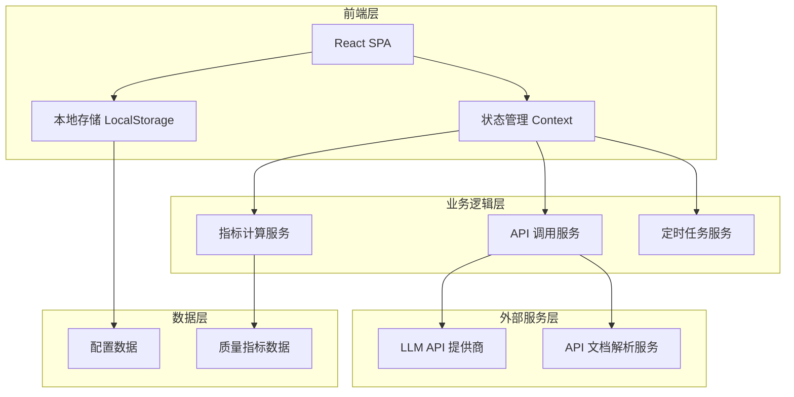

# LLM 服务质量实时监控平台 - 技术架构文档

## 1. 架构设计



## 2. 技术选型

- **前端框架**：React 18
- **构建工具**：Vite
- **样式方案**：Tailwind CSS
- **图标库**：Lucide React
- **字体**：Google Fonts (JetBrains Mono + Noto Sans SC)
- **状态管理**：React Context + useReducer
- **数据持久化**：LocalStorage

## 3. 路由定义

| 路由 | 用途 |
|------|------|
| / | 仪表盘首页 (模型卡片网格) |
| /settings | 设置页面 (API Key 配置) |

## 4. 页面组件结构

```
src/
├── components/
│   ├── Layout/
│   │   ├── Header.tsx        # 顶部导航栏
│   │   └── Container.tsx    # 页面容器
│   ├── Dashboard/
│   │   ├── ModelCard.tsx    # 模型卡片组件
│   │   ├── ModelGrid.tsx    # 模型卡片网格
│   │   └── BusyIndicator.tsx # 繁忙度指示器
│   ├── Settings/
│   │   └── SettingsPanel.tsx # 设置面板
│   └── Modal/
│       └── AddModelModal.tsx # 添加模型弹窗
├── contexts/
│   └── AppContext.tsx       # 全局状态上下文
├── hooks/
│   ├── useMonitoring.ts     # 监控数据采集
│   └── useLocalStorage.ts   # 本地存储 Hook
├── services/
│   ├── api.ts               # API 调用服务
│   └── metrics.ts          # 指标计算服务
├── types/
│   └── index.ts             # TypeScript 类型定义
├── App.tsx
├── main.tsx
└── index.css
```

## 5. 数据模型

### 5.1 模型配置

```typescript
interface ModelConfig {
  id: string;
  name: string;
  apiDocUrl: string;
  apiEndpoint: string;       // 解析自 API 文档
  apiKeyId: string;           // 关联的 API Key
  createdAt: number;
}
```

### 5.2 API Key 配置

```typescript
interface ApiKeyConfig {
  id: string;
  provider: 'openai' | 'anthropic' | 'azure' | 'custom';
  key: string;               // 加密存储
  label: string;
}
```

### 5.3 质量指标

```typescript
interface QualityMetrics {
  modelId: string;
  responseTime: number;      // ms
  errorRate: number;         // percentage
  successRate: number;       // percentage
  busyLevel: 'idle' | 'normal' | 'busy' | 'danger';
  lastUpdated: number;
  history: {
    timestamp: number;
    responseTime: number;
    success: boolean;
  }[];
}
```

## 6. 核心算法

### 6.1 繁忙度计算

```
busyLevel = 
  if avgResponseTime < 500ms: 'idle'
  else if avgResponseTime < 2000ms: 'normal'
  else if avgResponseTime < 5000ms: 'busy'
  else: 'danger'
```

### 6.2 响应时间计算

使用滑动窗口算法，取最近 10 次请求的算术平均值。

## 7. 定时任务配置

- **默认采样周期**：30 秒
- **历史数据保留**：最近 100 条
- **指标计算时机**：每次采样完成后
